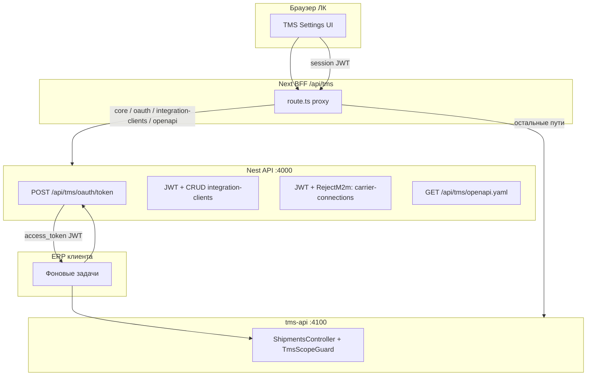

# TMS: безопасность и внешнее API

## Цели

- Разделить **интерактивный доступ** (личный кабинет) и **машинный доступ** (ERP/WMS клиентов).
- Хранить **только хэши** долгоживущих секретов; для вызовов API выдавать **короткоживущие JWT** с ограниченными **scopes**.
- Не допускать использования M2M-токена к **управлению учётками перевозчиков** и другим чувствительным маршрутам основного API.

## Архитектура (высокий уровень)

## Поток OAuth2 client credentials

1. Владелец аккаунта в ЛК создаёт **integration client** → получает пару `client_id` (UUID) и `client_secret` **один раз** (показ в UI).
2. Внешняя система вызывает `POST /api/tms/oauth/token` с телом JSON:
   `{ "grant_type": "client_credentials", "client_id": "...", "client_secret": "..." }`.
3. API проверяет `sha256(client_secret)` по записи в БД, выдаёт **JWT** с полями `typ: "tms_m2m"`, `scope` (через пробел), `sub` = `userId` владельца.
4. Запросы к **tms-api** выполняются с `Authorization: Bearer <access_token>`. Guard проверяет scope: `tms:read` / `tms:write`.

## Защита основного API

- Все маршруты `TmsIntegrationController` защищены **`RejectTmsM2mJwtGuard`**: M2M JWT не может читать/менять **логины и пароли перевозчиков**.
- Управление списком integration clients — только **сессия ЛК** (тот же guard).
- Внутренний вызов учёток для tms-api по-прежнему требует **`x-tms-internal-key`** (сервис-сервис).

## Операционные параметры

| Переменная | Назначение |
|------------|------------|
| `JWT_SECRET` | Общий секрет подписи user JWT и M2M access token (минимум 32 символа в production). |
| `TMS_M2M_TOKEN_EXPIRES_IN` | TTL выданного access token (например `1h`, `30m`). По умолчанию `1h`. |
| `TMS_INTERNAL_KEY` | Ключ сервис-сервис между tms-api и core. |
| `CORS_ORIGIN` | Для tms-api в production — явный список origin (через запятую). |

## Документация API

- Живая спецификация: **`GET /api/tms/openapi.yaml`** (на том же хосте, что и API, или через BFF приложения).
- Расширение OpenAPI (новые пути TMS) — правка строки в `apps/api/src/modules/tms-integration/tms-m2m.service.ts` (`TMS_EXTERNAL_OPENAPI_YAML`) или вынесение в отдельный YAML-файл при росте спецификации.

## Дальнейшие шаги (по мере роста)

- Ротация секретов клиента без простоя (два активных secret hash).
- Аудит вызовов M2M (`client_id`, маршрут, IP).
- Опционально **mTLS** для крупных интеграций.
- Отдельный **audience/issuer** и ключ подписи только для TMS, если JWT пользователя и M2M нужно полностью развести криптографически.
